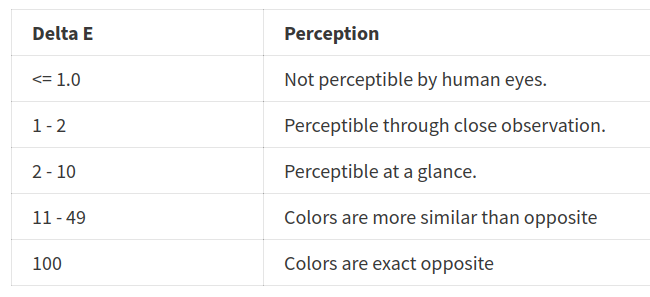

# Hex to Tailwind

Hex to Tailwind converts a hex color to a Tailwind preset using the Delta E color proximity algorithm.

This is a useful graphic explaining the values that Delta E can take [1](http://zschuessler.github.io/DeltaE/learn/) 

## Features

### 1.0.0

Initial release of Hex to Tailwind
